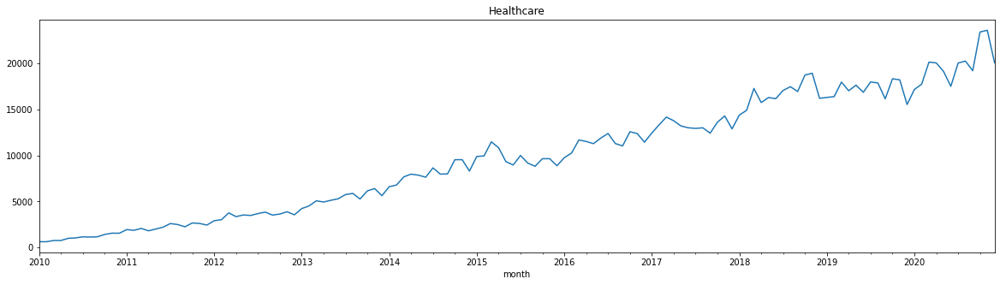
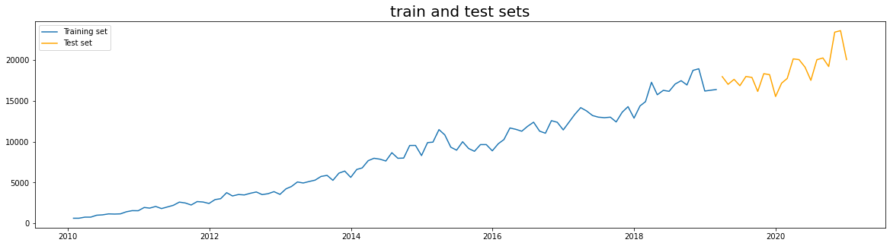
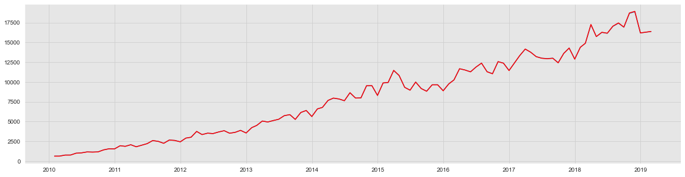
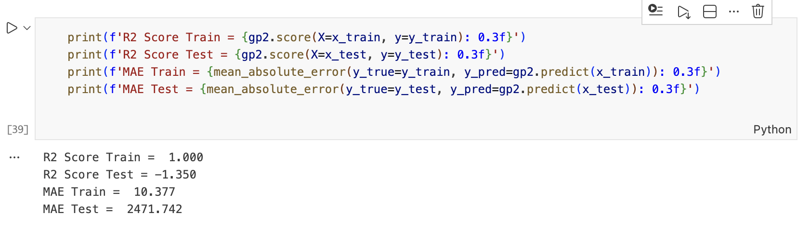

# Gaussian Time Series MLOps Pipeline on AWS


> Production-grade MLOps pipeline for Gaussian Process time series forecasting with automated CI/CD, staged deployments, and infrastructure-as-code on AWS.

## Overview

This project demonstrates how to operationalize a machine learning model for time series forecasting using industry-standard MLOps practices. The pipeline features a **staged deployment workflow** (staging -> approval -> production) ensuring safe, validated releases of the Gaussian Process regression model.

The system processes healthcare call center volume data to generate forecasts with confidence intervals, served via a REST API deployed on AWS Lightsail containers.

## Architecture

```
GitHub Repository
       |
       v
AWS CodePipeline (triggered on commit)
       |
       +---> [STAGING ENVIRONMENT]
       |         |
       |         v
       |     AWS CodeBuild (build Docker image)
       |         |
       |         v
       |     Amazon ECR (staging repository)
       |         |
       |         v
       |     AWS Lightsail (staging container)
       |         |
       |         v
       |     SNS Notification (manual approval)
       |
       +---> [PRODUCTION ENVIRONMENT]
                 |
                 v
             AWS CodeBuild (reuse tested image)
                 |
                 v
             Amazon ECR (production repository)
                 |
                 v
             AWS Lightsail (production container)
                 |
                 v
             Flask API (public endpoint)
                 |
                 +---> S3 (fetch input data)
                 |
                 +---> Gaussian Process Model
                 |
                 +---> Predictions + Confidence Intervals
```

## Tech Stack

| Category | Technologies |
|----------|-------------|
| **Language** | Python 3.7+ |
| **ML Framework** | scikit-learn (Gaussian Process Regressor) |
| **Data Processing** | pandas, numpy, scipy |
| **Visualization** | matplotlib, seaborn |
| **Web Framework** | Flask, flask-cors |
| **Containerization** | Docker |
| **Infrastructure** | Terraform (IaC) |
| **CI/CD** | AWS CodePipeline, AWS CodeBuild |
| **Container Registry** | Amazon ECR |
| **Deployment** | AWS Lightsail Container Service |
| **Storage** | Amazon S3 |
| **Notifications** | Amazon SNS |
| **Monitoring** | AWS CloudWatch |
| **AWS SDK** | boto3 |

## Key Features

- **Gaussian Process Regression**: Probabilistic time series model with uncertainty quantification
- **Confidence Intervals**: Predictions include 95% confidence bounds (mean +/- 2*std)
- **Infrastructure-as-Code**: Complete AWS infrastructure provisioned via Terraform
- **Staged Deployments**: Staging environment with manual approval before production
- **Automated CI/CD**: Every commit triggers the full pipeline
- **REST API**: Flask-based prediction endpoint with S3 data integration
- **Containerized**: Consistent deployment across environments via Docker

## Project Structure

```
gaussian-timeseries-mlops-aws/
├── Code/
│   ├── MLOps_files/
│   │   ├── MLPipeline/
│   │   │   ├── Gaussian_Stationary.py     # Core ML model
│   │   │   └── Gaussian_Trend.py          # Trend decomposition variant
│   │   ├── notebook/
│   │   │   └── Gaussian Process.ipynb     # Model development notebook
│   │   ├── Input/
│   │   │   └── CallCenterData.csv         # Training data
│   │   ├── Output/
│   │   │   ├── model.pkl                  # Trained model
│   │   │   └── *.png                      # Visualization outputs
│   │   ├── app.py                         # Flask REST API
│   │   ├── Engine.py                      # Model inference engine
│   │   ├── Dockerfile                     # Container definition
│   │   ├── requirements.txt               # Python dependencies
│   │   ├── buildspec-staging.yaml         # CodeBuild staging config
│   │   └── buildspec-prod.yaml            # CodeBuild production config
│   └── Terraform/
│       ├── main.tf                        # AWS infrastructure definition
│       ├── providers.tf                   # Terraform provider config
│       └── secrets.tfvars                 # Sensitive variables (gitignored)
├── Data/
│   └── CallCenterData.csv                 # Sample dataset
└── Documentation/
    ├── Projectdetails.pdf
    ├── Solution Methodology.pdf
    └── Cost Breakdown.pdf
```

## What I Learned

- **MLOps Best Practices**: Implementing staging -> approval -> production workflow for safe ML deployments
- **Terraform for ML**: Provisioning complete ML infrastructure including ECR, CodePipeline, Lightsail, and SNS
- **Gaussian Process Models**: Understanding probabilistic predictions with uncertainty quantification
- **CI/CD for ML**: Automating model builds, testing, and deployment with AWS CodePipeline
- **Containerization**: Packaging ML models in Docker for consistent cross-environment deployment
- **API Design**: Building REST endpoints for model inference with S3 data integration

## Setup & Installation

### Prerequisites
- AWS Account with appropriate permissions
- Terraform installed locally
- Docker installed locally
- Python 3.7+

### 1. Clone and Configure

```bash
git clone https://github.com/Ctt011/gaussian-timeseries-mlops-aws.git
cd gaussian-timeseries-mlops-aws
```

### 2. Set Up AWS Credentials

Create `secrets.tfvars` in the Terraform directory:
```hcl
aws_access_key = "your-access-key"
aws_secret_key = "your-secret-key"
github_token   = "your-github-token"
```

### 3. Provision Infrastructure

```bash
cd Code/Terraform
terraform init
terraform validate
terraform plan -var-file="secrets.tfvars"
terraform apply -var-file="secrets.tfvars" --auto-approve
```

### 4. Local Development

```bash
cd Code/MLOps_files
pip install -r requirements.txt
python app.py
```

## Usage

### API Endpoints

**Health Check:**
```bash
curl http://localhost:5000/check
```

**Get Predictions:**
```bash
curl -X POST http://<lightsail-endpoint>
```

### Model Training

```bash
cd Code/MLOps_files
python -c "from MLPipeline.Gaussian_Stationary import *; train_model()"
```

## Results

The Gaussian Process model provides:
- **Point Predictions**: Expected call center volume for future time periods
- **Confidence Intervals**: Upper and lower bounds for predictions
- **Visualization**: Training/test split and prediction plots

### Model Performance

**10-Year Healthcare Call Volume Trend (2010-2020)**


**Train/Test Split (110 train / 22 test months)**


**Model Predictions vs Actual (Training Data)**


**Model Metrics**

*Achieved R² = 1.0 and MAE = 10.4 on 132 months of historical call center data*

**Error Distribution Analysis**


## CI/CD Pipeline Flow

1. **Commit** code changes to GitHub
2. **CodePipeline** automatically triggers
3. **Staging Build**: CodeBuild creates Docker image, pushes to staging ECR
4. **Staging Deploy**: Lightsail deploys container for testing
5. **Approval**: SNS notification sent; manual approval required
6. **Production Build**: Approved image promoted to production ECR
7. **Production Deploy**: Lightsail deploys to public endpoint

## Future Enhancements

- [ ] Add model versioning with MLflow
- [ ] Implement A/B testing between model versions
- [ ] Add data drift detection
- [ ] Create Grafana monitoring dashboard
- [ ] Add automated retraining pipeline
- [ ] Implement model performance alerting

## Cost Considerations

AWS services used in this project may incur charges. Key cost drivers:
- AWS Lightsail Container Service
- AWS CodeBuild compute time
- S3 storage and requests

Remember to run `terraform destroy` when done to avoid unnecessary costs.

## Acknowledgments

- Implemented as part of data engineering portfolio
- Based on ProjectPro MLOps project template
- Demonstrates proficiency in MLOps, AWS, and Infrastructure-as-Code
